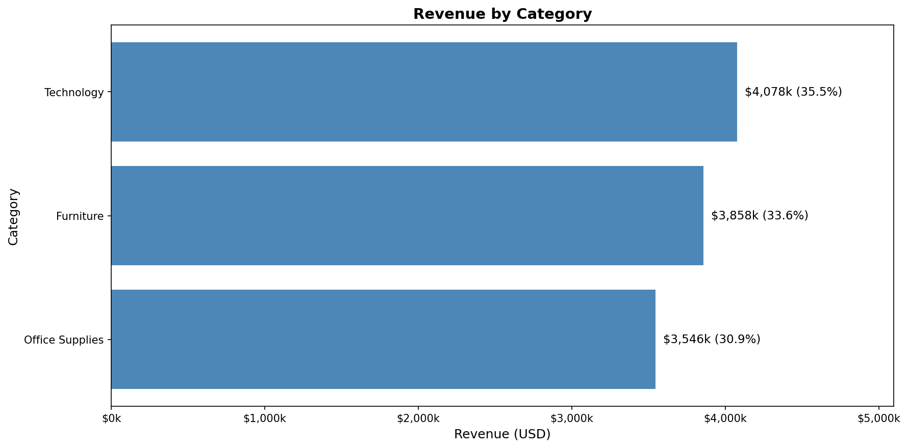
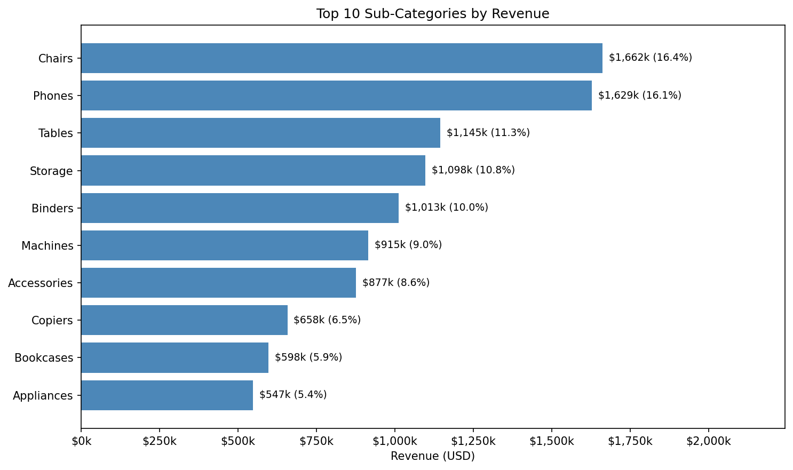
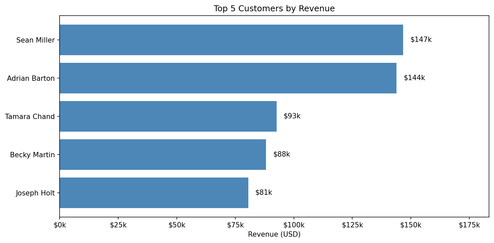
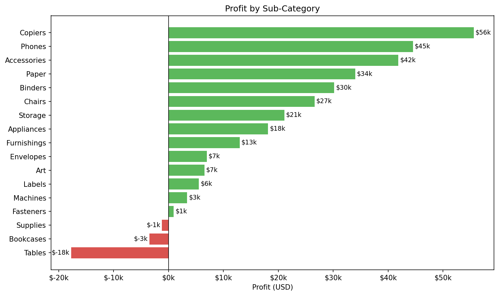

# Sales Analysis - Python

A complete end-to-end analysis of the Superstore Sales dataset using Python.

---

## Table of Contents

1. [Project Overview](#1-project-overview)
2. [Business Questions](#2-business-questions)
3. [Dataset](#3-dataset)
4. [Methodology](#4-methodology)
5. [Findings](#5-findings)
6. [Visualizations](#6-visualizations)
7. [Technologies](#7-technologies)
8. [Project Structure](#8-project-structure)
9. [How to Run](#9-how-to-run)
10. [Author](#10-author)
11. [License](#11-license)
## 1. Project Overview

This project analyzes three years of Superstore sales data to answer common business questions using Python. It covers data loading, cleaning, feature engineering, analysis, and visualization.

The goal is to demonstrate a full exploratory data analysis (EDA) workflow and extract meaningful insights for business decision-making.

---

## 2. Business Questions

- Which product categories generate the most revenue?
- Which sub-categories are losing money?
- Which regions perform best?
- Who are the top customers?
- How has revenue changed over time?

---

## 3. Dataset

| Attribute | Details |
|-----------|---------|
| Source | Kaggle Superstore Sales |
| Rows | 9,994 |
| Columns | 21 |
| Period | 2015 to 2018 |

---

## 4. Methodology

1. Data loading and exploration
2. Data cleaning (missing values, duplicates, invalid values)
3. Feature engineering (Line_Total, Discount_Amount, Profit_Per_Line)
4. Business analysis using groupby summaries
5. Visualization with Matplotlib
6. Report generation (JSON and text)

---

## 5. Findings

### Overall Metrics

| Metric | Value |
|--------|-------|
| Total Revenue | $11,481,900.36 |
| Total Profit | $286,013.82 |
| Total Orders | 5,009 |
| Units Sold | 37,840 |
| Average Order Value | $2,292.25 |
| Average Discount | 15.6% |

### Category Performance

| Category | Revenue | Share |
|----------|---------|-------|
| Technology | $4,077,983 | 35.5% |
| Furniture | $3,857,793 | 33.6% |
| Office Supplies | $3,546,124 | 30.9% |



### Top 5 Sub-Categories by Revenue

| Sub-Category | Revenue |
|--------------|---------|
| Chairs | $1,662,195 |
| Phones | $1,628,828 |
| Tables | $1,144,514 |
| Storage | $1,097,596 |
| Binders | $1,012,914 |



### Loss-Making Sub-Categories

| Sub-Category | Profit |
|--------------|--------|
| Tables | $-17,725.48 |
| Bookcases | $-3,472.56 |
| Supplies | $-1,189.10 |


### Regional Performance

| Region | Revenue |
|--------|---------|
| West | $3,594,409 |
| East | $3,376,934 |
| Central | $2,475,833 |
| South | $2,034,725 |

### Top 5 Customers

| Customer | Revenue | Orders |
|----------|---------|--------|
| Sean Miller | $146,750 | 5 |
| Adrian Barton | $143,858 | 10 |
| Tamara Chand | $92,603 | 5 |
| Becky Martin | $88,175 | 4 |
| Joseph Holt | $80,520 | 6 |

---

## 6. Visualizations

All charts are stored in the `charts/` folder.

| Chart | File |
|-------|------|
| Revenue by Category | charts/revenue_by_category.png |
| Top 10 Sub-Categories | charts/top_subcategories.png |
| Revenue by Region | charts/revenue_by_region.png |
| Top 5 Customers | charts/top_customers.png |
| Profit by Sub-Category | charts/profit_by_subcategory.png |
| Revenue Over Time | charts/revenue_over_time.png |

---

## 7. Technologies

| Tool | Role |
|------|------|
| Python 3.8+ | Core language |
| Pandas | Data manipulation |
| NumPy | Numerical operations |
| Matplotlib | Visualization |
| Jupyter Notebook | Interactive development |

---

## 8. Project Structure
```
Sales-Exploratory-Analysis-Python/
├── Charts/
│ ├── profit_by_subcategory.png
│ ├── revenue_over_time.png
│ ├── revenue_by_category.png
│ ├── revenue_by_region.png
│ ├── top_customers.png
│ └── top_subcategories.png
├── Data/
│ ├── Processed_Data/
│ │ └── cleaned_sales.csv
│ └── superstore_data.csv
├── NoteBooks/
│ └── Sales_Analysis.ipynb
├── OUTPUT/
│ └── summary.json
└── README.md
```
---
### Revenue by Category


### Top 10 Sub-Categories


### Revenue by Region


### Top 5 Customers



### Profit by Sub-Category



### Revenue Over Time


## 9. How to Run

### Prerequisites

- Python 3.8 or higher
- Jupyter Notebook
- pip (Python package manager)

### Installation

1. Clone the repository:

```bash
git clone https://github.com/adilshah150139/Sales-Exploratory-Analysis-Python.git
cd Sales-Exploratory-Analysis-Python
```
